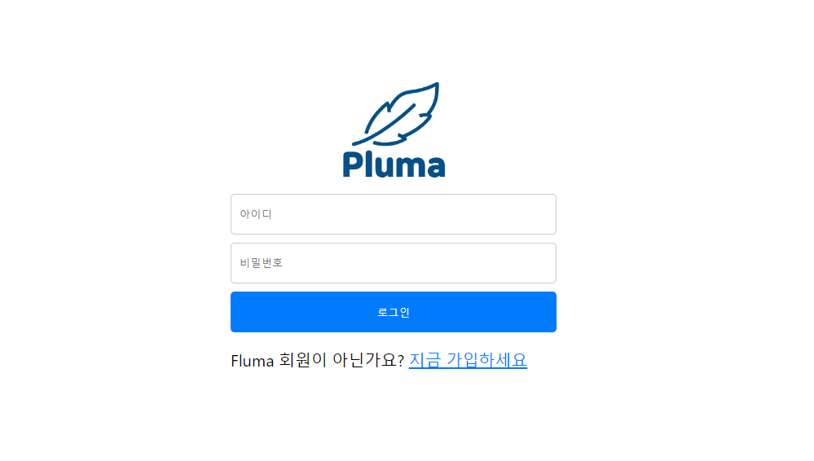
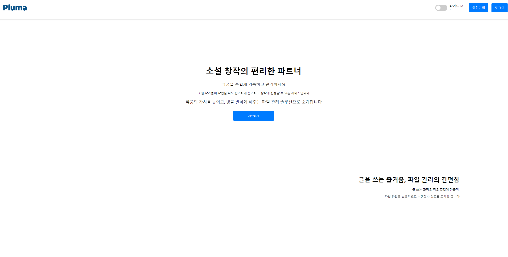
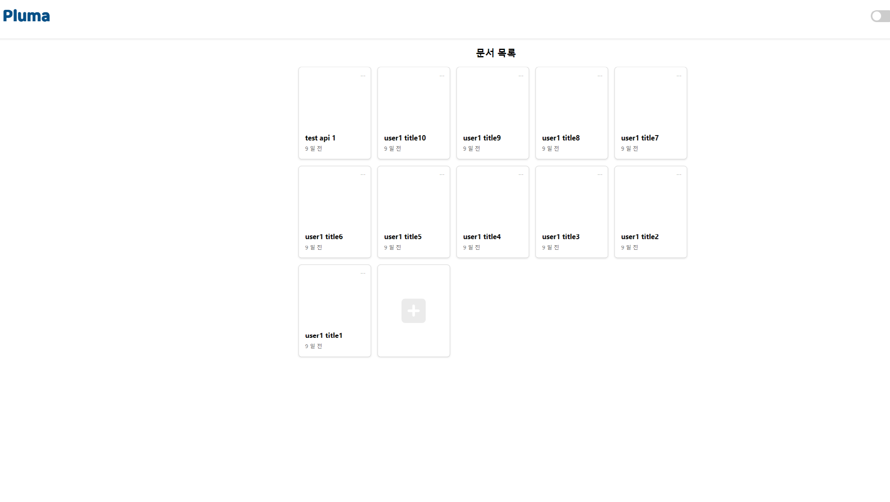
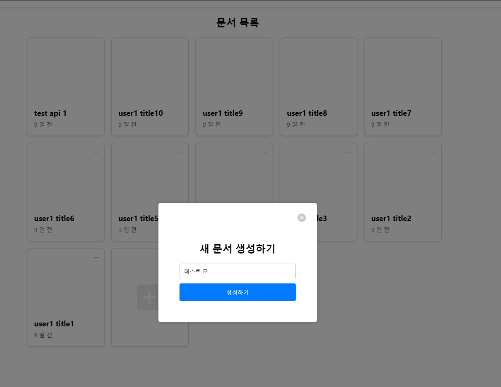
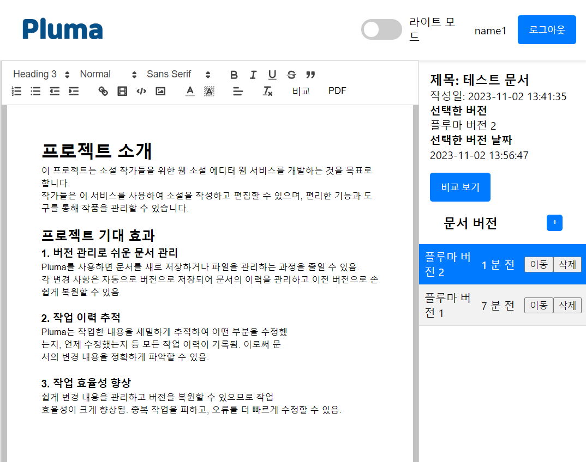
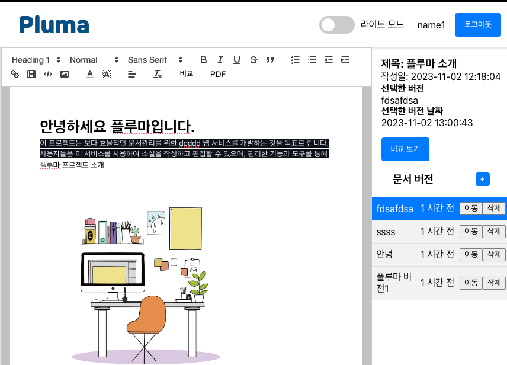
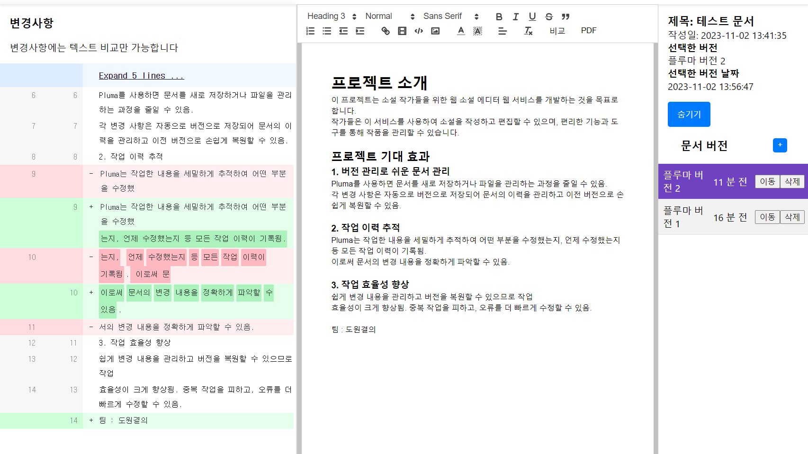
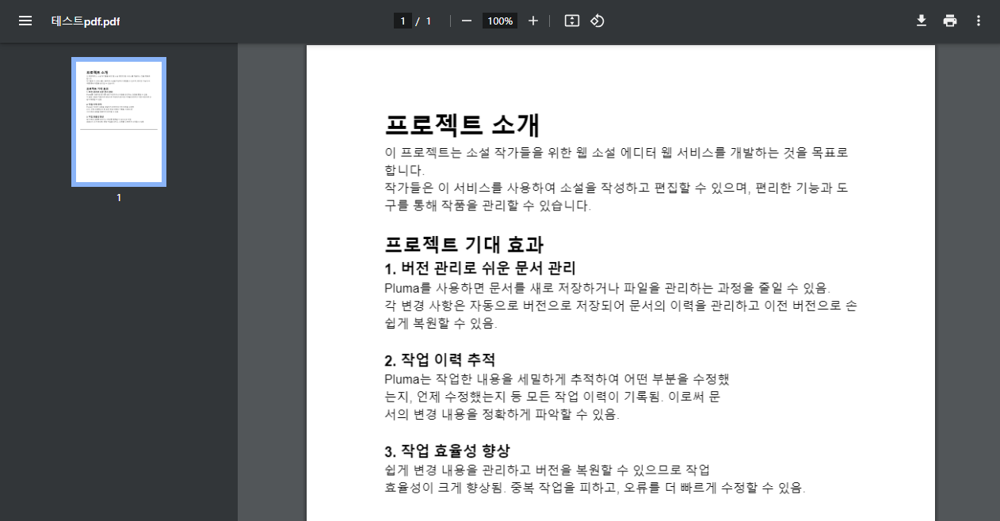
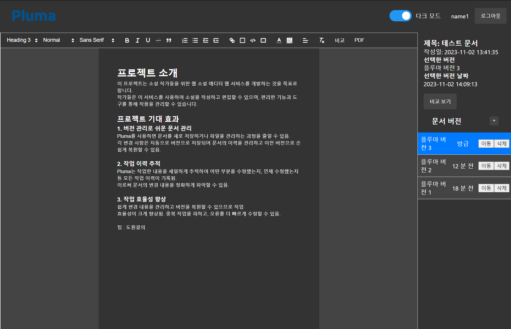

# 플루마(Pluma)
## 프로젝트 소개
이 프로젝트는 문서를 더 편하게 사용하고자 하는 사람들을 위한 웹 문서 에디터 웹 서비스를 개발하는 것을 목표로 합니다.
사용자들은 이 서비스를 사용하여 문서를 작성하고 편집할 수 있으며, 편리한 기능과 도구를 통해 작품을 관리할 수 있습니다.

## 주요 기능
* 문서 작성: 웹 기반의 에디터를 통해 문서를 작성하고 저장할 수 있습니다.
* 편집 도구: 텍스트 편집을 위한 다양한 도구 및 서식을 제공합니다.
* 저장 및 백업: 문서를 안전하게 저장하고 백업할 수 있습니다.
* 문서 버전 관리: 문서의 버전을 관리하고 변경 내용을 추적할 수 있습니다. 사용자들은 버전으로 문서 작업 과정을 분리하여, 이전 버전으로 손쉽게 복구할 수 있습니다.
* 사용자 관리: 사용자들은 개별 계정을 생성하고 로그인하여 자신의 작품을 관리할 수 있습니다.

### 로그인 페이지

### 시작 페이지

### 문서 페이지

### 문서 생성 페이지

### 버전 에디터 페이지

### 이미지 업로드

### 버전 비교 페이지

### PDF 다운로드

### 다크모드 페이지
